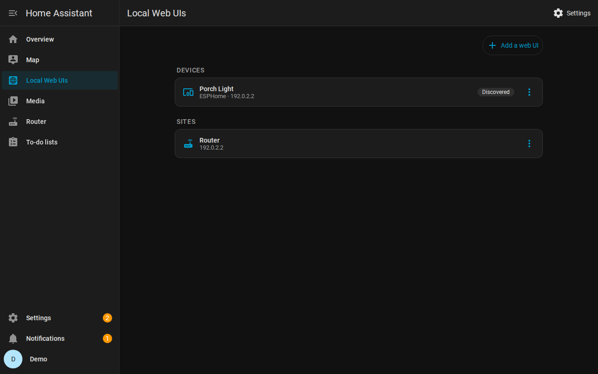
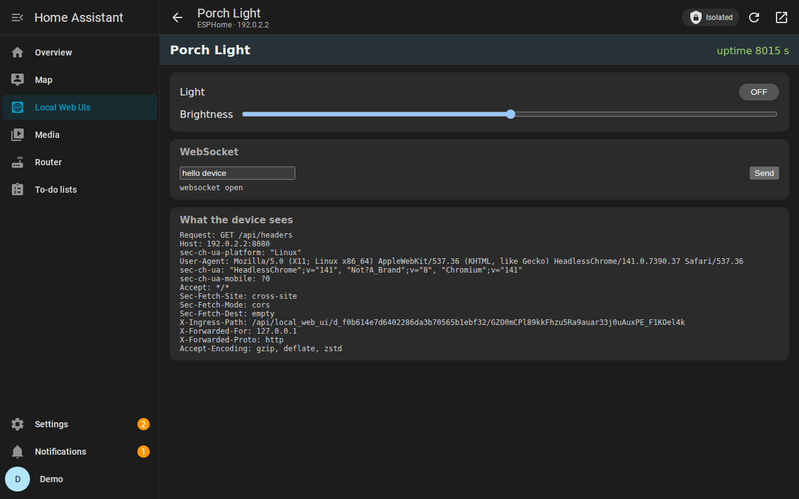
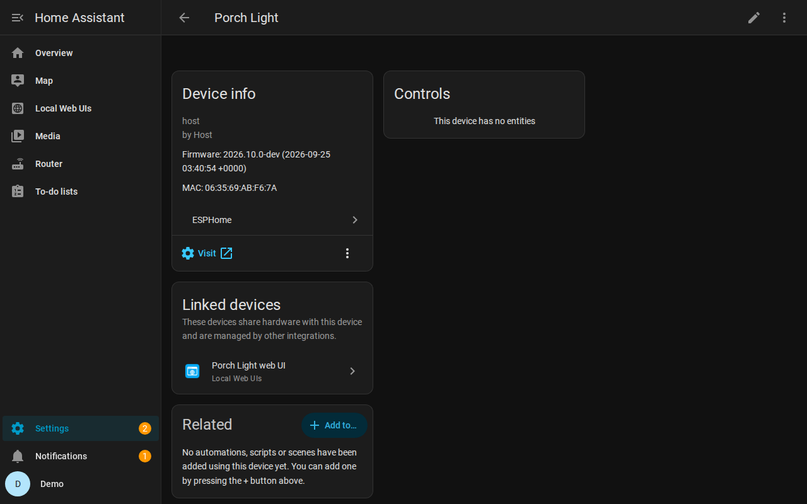

# Local Web UIs for Home Assistant

Open the web UIs of your local devices and sites **inside Home Assistant**: ESPHome's
`web_server`, WLED, printers, routers, NAS dashboards. Home Assistant proxies them, so they
work wherever Home Assistant works:
- away from home, through Nabu Casa or your own reverse proxy;
- over HTTPS, with no mixed-content errors;
- in the companion apps.

You don't need to open ports or change any firmware.

| All your web UIs in one place | A device's own UI, proxied | On the device page |
|---|---|---|
|  |  |  |

## Features

- **Discovery.** Devices whose integration links to a local web page (the device page's
  **Visit** button) appear automatically under the device's name. That covers ESPHome
  devices with `web_server`, WLED, many printers and routers.
- **Your own sites.** Add any page your Home Assistant server can reach under
  *Settings → Devices & services → Local Web UIs → Add web UI*. For each one you can set:
  - a name, URL and icon;
  - a stored login, sent as HTTP Basic auth so you are never prompted;
  - whether to verify the SSL certificate;
  - its own sidebar entry.
- **Customize discovered devices.** Use ⋮ → *Customize* to rename a discovered UI or change
  its mode or login.
- **Device page "Visit" links (optional, on by default).** The **Visit** button of
  discovered devices opens their web UI here instead of the LAN address, which fails away
  from home. You can switch this globally in the integration options, and per device from
  the panel (on, off, or follow the global setting). The original links are restored when
  you switch it off or remove the integration.
- **Linked devices (optional, off by default).** Instead of, or as well as, changing the
  Visit button, Local Web UIs can add a "*device* web UI" device next to each device. Home
  Assistant shows it in the **Linked devices** card of the device's page, and its Visit
  button opens the web UI here. The device itself is left alone.
- **Standalone pages.** Every web UI has its own address (`/local-web-ui/<id>`), an optional
  sidebar entry, and *open in a new tab* for a full-page view.
- **Isolated by default.** See the next section.

## Isolated and trusted

A web page served from Home Assistant's own address normally has full access to Home
Assistant as you. It can read your login token, change your configuration or unlock your
doors. That's fine for code you trust, but not for a router's admin page or an IoT device's
firmware.

**Isolated** (the default) runs each web UI with an *opaque origin*: the browser treats it as
belonging to no site. The page works normally, but it cannot touch Home Assistant. What the
browser then withholds from the page, Local Web UIs provides:

| | How it works when isolated |
|---|---|
| Logins and cookies | Kept server side per Home Assistant user, so they survive reloads and follow you across devices. *⋮ → Forget saved logins and data* logs you out. |
| `localStorage` | Emulated and stored server side per user. |
| `sessionStorage` | Emulated for the current page. |
| `document.cookie` | Emulated, backed by the same cookie store. |
| API calls, WebSockets, live updates | Passed through (CORS is handled for you). |
| IndexedDB, offline caches | Not available; pages that check for them fall back. |

**Trusted** runs the page with Home Assistant's own origin, as Supervisor apps (add-ons) do.
Use it only for pages that need a browser feature the emulation doesn't cover (IndexedDB,
a `sessionStorage` that survives reloads, `window.parent` access), and **only for pages
you fully trust**. The form makes you confirm. Site cookies stay server side in this mode
too, and service workers are refused in both modes.

## Install

Requires Home Assistant 2026.9 or newer.

1. In HACS: ⋮ → *Custom repositories* → add `https://github.com/ashald/ha-local-web-ui` with
   type *Integration*.
2. Install **Local Web UIs** and restart Home Assistant.
3. *Settings → Devices & services → Add integration → Local Web UIs.*
4. Open **Local Web UIs** in the sidebar. It is visible to admin users only.

## How it works

```
browser ──HTTPS──► Home Assistant  /api/local_web_ui/<web UI>/<session>/…
                        │  (session checked; target from your config, never from the request)
                        └──HTTP(S)──► device / site on your LAN
```

- The panel asks Home Assistant for a short-lived session (256-bit, expires after 5 minutes
  of inactivity) and opens the web UI in an iframe under that path.
- **Rewriting.** Links, redirects, stylesheets and URLs the page builds at runtime (`fetch`,
  XHR, WebSockets, `EventSource`, history, dynamic `src`/`href`) are rewritten to stay under
  that path.
- **Headers.** The proxy drops headers that would break or leak the session: it replaces
  `Origin`, which device UIs reject as cross-origin, and it keeps `Referer` from carrying
  the session. Your browser's credentials for Home Assistant (cookies, a reverse proxy's
  login) never reach a device, and a device's headers cannot change how the browser treats
  Home Assistant. Pages built for Supervisor ingress get the `X-Ingress-Path` they expect.
- **Streaming.** Downloads, server-sent events and WebSockets are streamed.
- **Discovery filter.** Discovery only picks up addresses on your local network. It never
  picks up loopback, link-local, cloud-metadata, Home Assistant itself or Supervisor's
  internal network. Web UIs you add by hand can point anywhere.

See [docs/DESIGN.md](docs/DESIGN.md) for the details.

## Limitations

- **Admin only.** Web UIs are available to admin users only (for now).
- **Absolute URLs in JavaScript modules.** Some URLs can't be rewritten, most notably
  root-relative `import "/…"` statements in JavaScript modules. A page that relies on them may
  not load. The same goes for a page that builds URLs from `location.origin` while isolated,
  because an isolated page's origin is `null`. Trusted mode usually fixes the second case.
- **No browser login prompts.** For HTTP Basic auth, store the login in the web UI's
  settings (*Customize* for a discovered device). The browser's own prompt is not used,
  and credentials the browser holds are never sent to devices. HTTP Digest auth is not
  supported.
- **Home Assistant's request filter.** Home Assistant rejects URLs that look like attacks
  (`../`, `<script>`, SQL keywords) before they reach the proxy, and logs them, including
  the session path. A few router diagnostic pages can run into this.
- **The device sees the session path.** It arrives in the `X-Ingress-Path` header, so the page
  can build links. The session only grants access to that one web UI, and only for a few
  minutes.

## Relation to ESPHome native API tunnelling

A deeper variant tunnels the web UI over ESPHome's encrypted native API connection instead of
plain LAN HTTP. That removes the need for the device's web server to be reachable on the LAN
at all. It needs changes to ESPHome, aioesphomeapi and Home Assistant core; see
[ashald/esphome@variant-1](https://github.com/ashald/esphome/tree/variant-1/poc). This
integration is designed to become its carrier.

## Related projects

- [hass_ingress](https://github.com/lovelylain/hass_ingress) (custom integration, in the HACS
  default list) proxies URLs you list in YAML at `/api/ingress/<name>/`, each with its own
  sidebar panel. Proxied pages share Home Assistant's origin, so they can act as you.
- [Multi-App Proxy](https://github.com/Pulpyyyy/multiappproxy) and
  [Admin Panels](https://github.com/WilliamFriconneau/ha-admin-panels) are apps (add-ons)
  that proxy several LAN UIs behind one ingress panel, also on Home Assistant's origin.
- Browser-in-the-sidebar apps (Firefox, Chromium) stream a whole remote browser: fully
  isolated, but heavy, and not native on phones.

Local Web UIs differs in three ways: it finds device UIs itself (from the device list),
it isolates each page from Home Assistant by default, and it keeps each site's cookies
separately per user on the server. An app (add-on) alone cannot isolate pages: Supervisor
ingress authenticates with a `SameSite=Strict` cookie that isolated pages never send.

## Development

```bash
python3.14 -m venv .venv && . .venv/bin/activate
pip install pytest-homeassistant-custom-component home-assistant-frontend
pytest                      # unit and integration tests
```

`tests/e2e/` holds an end-to-end setup:
- stand-in device UIs;
- an ESPHome host-platform device;
- `ha_setup.py`, which configures a running Home Assistant;
- `browser_e2e.mjs`, a Playwright run that exercises everything in Chromium.

## License

MIT
